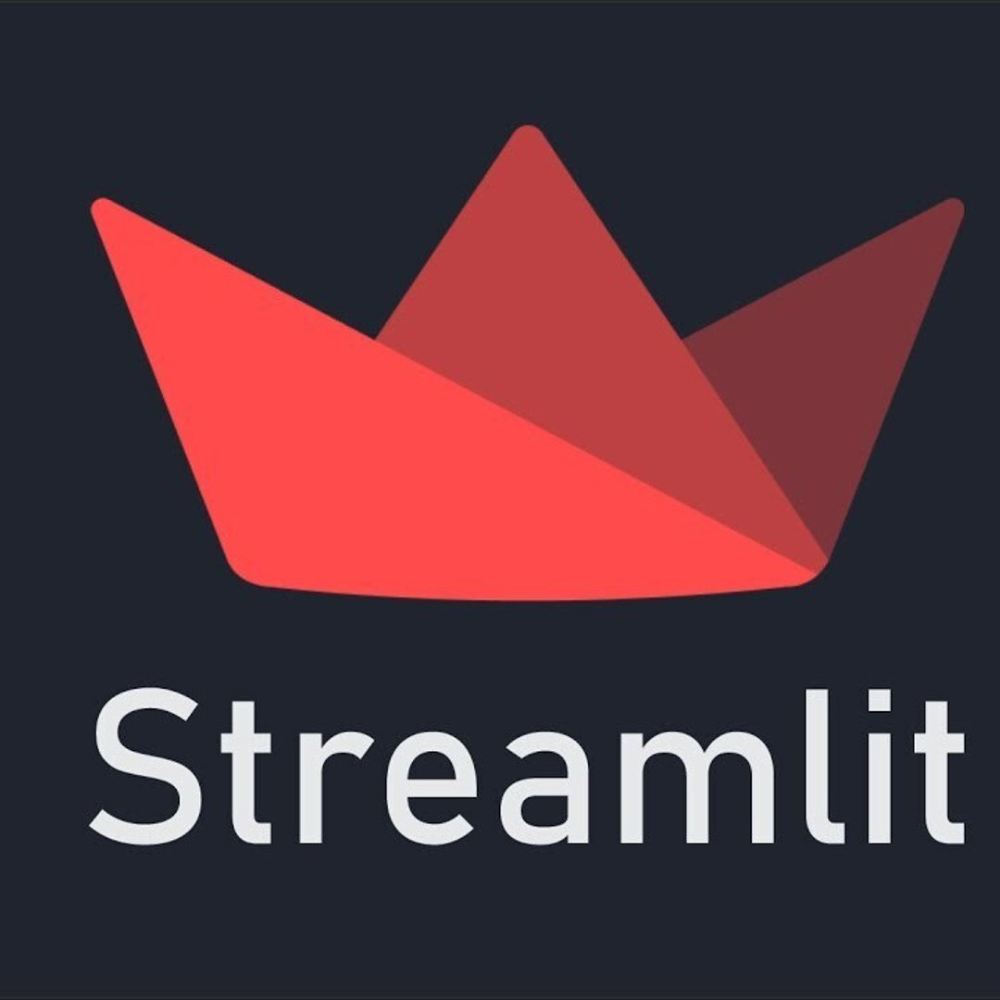
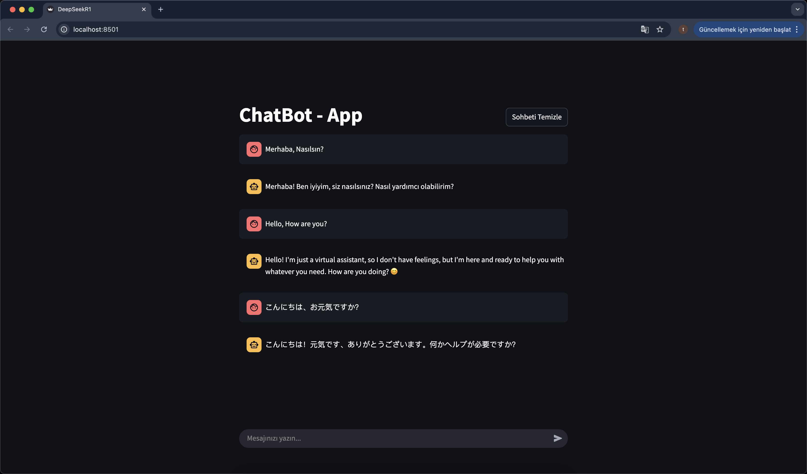

<h1 align="center">
    
    
    
  
  <br>
  🔥Local'de çalışan Chatbot🔥
</h1>

---

Bu proje, Flask tabanlı bir REST API ile Streamlit arayüzünü birleştirerek, Ollama üzerinden çalışan bir dil modeli (örneğin, DeepSeek-r1) ile etkileşimli bir sohbet deneyimi sunar. Hem API üzerinden Postman gibi araçlarla mesaj gönderebilir hem de Streamlit arayüzü ile kullanıcı dostu bir şekilde sohbet edebilirsiniz.
---

# 📷 Local Chat 


---


## Özellikler

- **Flask REST API:** /api/chat endpoint’i üzerinden mesaj alır ve modeli çalıştırarak yanıt döndürür.
- **Streamlit Arayüzü:** Kullanıcı dostu bir web arayüzü ile sohbet etmenizi sağlar.
- **Ollama Desteği:** Lokal makinenizde DeepSeek R1 (veya başka bir model) çalıştırmak için Ollama CLI kullanılır.
- **JSON Formatı:** API istek ve yanıtları JSON formatındadır.
- **Modüler Yapı:** Flask backend flask_app klasöründe, Streamlit frontend streamlit_app klasöründe tutulur.

---

## Gereksinimler

1.	**Python 3.7+** (3.9 veya üstü önerilir)
2.	**Ollama CLI** (DeepSeek R1 modelini lokal olarak çalıştırmak için)
3.	**DeepSeek R1 (8B)** model dosyası (lokalde indirili olmalı)
4.	**Flask, Streamlit, Requests vb.** Python kütüphaneleri (details: requirements.txt)

> LLaMa 3.1 modeli, Ollama platformu üzerinden indirilebilir ve lokal makinede çalıştırılabilir. Aşağıdaki adımları takip ederek Ollama ve LLaMa 3.1 modelini yükleyip test edebilirsiniz.
> Ollama ve DeepSeek R1 (8B) model kurulum adımları için [ollama resmi dokümantasyonuna](https://ollama.com/library/deepseek-r1) göz atabilirsiniz.

---

# 🚀 Kurulum & Çalıştırma

## 1️⃣ Ollama ve DeepSeek R1 Modelini Kurun
LLaMa 3.1 modelini kullanabilmek için önce **Ollama CLI** aracını yüklemeniz gerekmektedir.

📌 macOS (Homebrew ile)
```bash
brew install ollama
```
📌 Linux (Debian / Ubuntu)
```bash
curl -fsSL https://ollama.com/install.sh | sh
```
📌 Windows (Manuel Kurulum)
Windows kullanıcıları Ollama’yı aşağıdaki adımlarla yükleyebilir:

1. **Ollama’nın resmi yükleyicisini indirin:**  
   🔗 [Ollama Windows Yükleyicisi](https://ollama.com/download/windows)

2. **İndirilen `.exe` dosyasını çalıştırın ve yükleme adımlarını tamamlayın.**


Kurulum tamamlandıktan sonra terminali kapatıp yeniden açın ve aşağıdaki komut ile Ollama'nın başarıyla yüklendiğini doğrulayın:
```bash
ollama --version
```
Eğer şu şekilde bir çıktı alıyorsanız, Ollama başarıyla kurulmuştur:
```bash
ollama 0.1.20
```

## 2️⃣ deepseek-r1 Modelini İndirin
Ollama başarıyla kurulduktan sonra, LLaMa 3.1 (8B) modelini bilgisayarınıza indirmek için şu komutu çalıştırın:
```bash
ollama pull deepseek-r1:8b
```
Model başarıyla indirildiğinde, aşağıdaki komut ile yüklü modelleri listeleyebilirsiniz:
```bash
ollama list
```
Çıktı şu şekilde olmalıdır:
| NAME      | ID             | SIZE  | MODIFIED    |
|-----------|---------------|-------|------------|
| deepseek-r1:8b | 46e0c10c039e | 4.9 GB | .. minutes ago |

Bu, modelin başarıyla indirildiğini ve kullanılmaya hazır olduğunu gösterir.


## 3️⃣ Projeyi Klonlayın ve Çalıştırın
1. **Projeyi Klonlayın**
    ```bash
    git clone https://github.com/aliakkayamain/local-chatbot.git
    ```
    Şimdi projenin içine girin:
    ```bash
    cd local-chatbot
    ```

2. **Sanal Ortam Oluşturun ve Aktif Edin**
    ```bash
    python -m venv venv
    ```
    📌 Windows için
    ```bash
    venv\Scripts\activate
    ```
    📌 macOS/Linux için
    ```bash
    source venv/bin/activate
    ```

3. **Gerekli Kütüphaneleri Yükleyin**
    ```bash
    pip install -r requirements.txt
    ```

4. **Flask API’yi Başlatın**

    📌 Windows için
    ```bash
    set FLASK_APP=flask_app
    flask run
    ```
    📌 macOS/Linux için
    ```bash
    export FLASK_APP=flask_app
    flask run
    ```
Varsayılan olarak sunucu http://127.0.0.1:5000 adresinde çalışacaktır.

5. **Streamlit Arayüzünü Başlatın**
Flask API çalışmaya devam ederken, ayrı bir terminal penceresi açın ve yine proje kök dizininde şu komutu çalıştırın:
    ```bash
    streamlit run app.py
    ```
Bu komut, http://localhost:8501 adresinde Streamlit arayüzünü başlatacaktır. Tarayıcınız otomatik olarak açılmazsa, adresi elle girebilirsiniz.

Not: Hem Flask API hem de Streamlit uygulaması aynı anda çalışmalı; bu nedenle iki ayrı terminal veya süreç kullanmanız gerekir.
•	Terminal 1: flask run
•	Terminal 2: streamlit run app.py

---

# 📂 Proje Yapısı
```
Local-Chatbot/
│
├── assets/               # Projede kullanılan görseller, ikonlar vb.
│   ├── icon/             # Farklı ikon dosyalarının saklandığı klasör
│   │   ├── flask.png
│   │   ├── ollama.png
│   │   └── streamlit.png
│   └── images/           # Ekran görüntüleri veya diğer resimler
│       └── demo.png
│
├── flask_app/            # Flask uygulaması (backend) ile ilgili kodlar
│   ├── __pycache__/      # Python tarafından derlenen bytecode dosyaları (otomatik)
│   ├── __init__.py       # Flask uygulamasını başlatan kod (create_app gibi)
│   ├── config.py         # Konfigürasyon ayarları (örn. DEBUG, MODEL_NAME)
│   └── routes/           # API endpoint'lerini içeren klasör
│       ├── __pycache__/ 
│       ├── __init__.py   # (boş olabilir) routes paketini tanımlar
│       ├── chat.py       # "/chat" endpoint'i
│       └── index.py      # "/" (root) endpoint'i
│
├── streamlit_app/        # Streamlit arayüz (frontend) kodları
│   ├── __pycache__/
│   ├── __init__.py       # (boş olabilir) streamlit_app paketini tanımlar
│   └── ui.py             # Streamlit arayüzünün ana kodları
│
├── venv/                 # Python sanal ortam (virtual environment) klasörü
│
├── .gitignore            # Git'e dahil edilmemesi gereken dosyaları belirleyen ayarlar
├── LICENSE               # Proje lisans dosyası (MIT vb.)
├── README.md             # Proje dokümantasyonu
├── requirements.txt      # Proje bağımlılıklarının listesi (Flask, Streamlit, vs.)
└── app.py                # Flask uygulamasının giriş noktası, create_app() veya benzeri
```

---

# 📌 Geliştirme İpuçları

<ul>
  <li>Flask ve Streamlit Ayrımı: Flask API <code>flask_app</code> içinde, Streamlit kodu <code>streamlit_app</code> içinde yer alır. Bu şekilde backend ve frontend mantığı ayrışır.</li>
  <li>Ollama Model Seçimi: <code>config.py</code> içinde <code>MODEL_NAME</code> gibi bir değişken tanımlayarak farklı modelleri kolayca deneyebilirsiniz.</li>
  <li>Hata Yönetimi: Hem API tarafında hem de Streamlit arayüzünde hata durumlarını yakalamak ve kullanıcıya anlamlı mesajlar döndürmek projenin kullanılabilirliğini artırır.</li>
</ul>

---

## 📬 İletişim  

<ul>
  <li>Geliştirici: Ali Akkaya</li>
  <li>E-posta: aliakkayamain@gmail.com</li>
  <li>GitHub: aliakkayamain</li>
</ul>
Herhangi bir sorun veya katkıda bulunmak isterseniz lütfen iletişime geçmekten çekinmeyin!

Teşekkürler ve iyi çalışmalar!

---

## License

This project is licensed under the MIT License - see the [LICENSE](LICENSE) file for details.